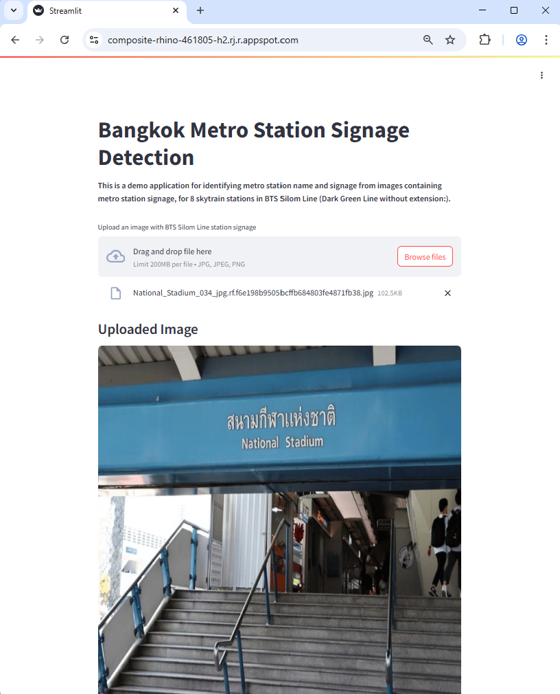
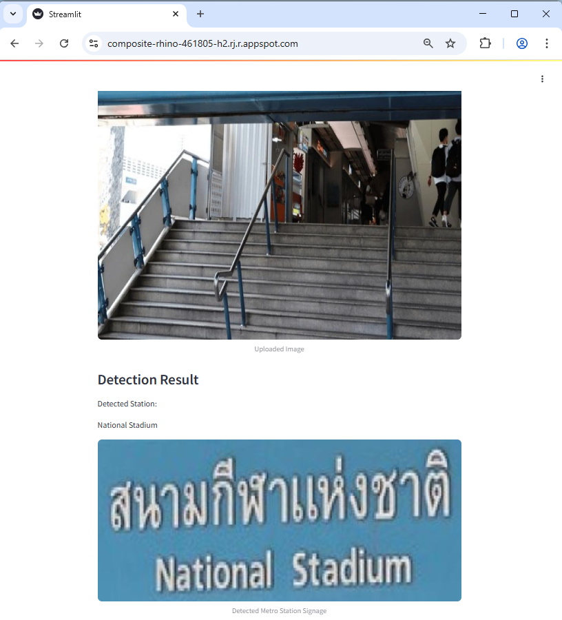

# AIPI 540: Final Project: Bangkok Metro Station Signage Detection with Improved Classification Accuracy
### **Author**: Matana Pornluanprasert

This project aims to enable foreign travelers to be able to recognize station name from signages of BTS Silom Line skytrain (Dark Green Line without extension) in Bangkok, Thailand. The app employs machine learning and deep learning models in order to ensure robust station name detection. YOLOv8n was used in the [previous project](https://github.com/beungz/metro-sign-detection) for signage detection and drawing of bounding box. The objective of this project is to improve the classification accuracy of station name detection, with the use of YOLOv8s for signage area detection, ViT (Vision Transformer) for CLS feature extraction, and SVC for classification. It was trained with images containing signages of 8 skytrain stations in BTS Silom Line (Dark Green Line without extension) in Bangkok, Thailand, and it can classify station name out of the list of these eight stations.<br>
<br>


***
# The Problem<br>
Being able to identify metro station name, and use it to search for relevant information is essential for free independent travelers roaming around a big city on their own. Bangkok, as one of the world’s top tourism destinations, has variety of tourists around the globe, including those who cannot speak or read English and Thai. Unfortunately, due to space limitation, metro station signages cannot be written in multiple languages. Chinese, Japanese, and Korean, for example, may not be able to read the signage or type in the station name in search engine on their mobiles to search for relevant information. To them, typing “Sala Daeng” or “Chong Nonsi” is as hard as typing “Kinderdijk-Elshout UNESCO Werelderfgoed” (Kinderdijk windmill site in the Netherlands) on their phones.<br>
<br>
This project aims to enable foreign tourists to be able to recognize metro station name from station signages of BTS Silom Line skytrain (Dark Green Line without extension) in Bangkok, Thailand. The possible enhancement to this project is to translate the station name to native languages that tourists can read and pronounce.<br>
<br>

***
# Previous work done to solve this problem<br>
Most signage detection researches are done on street-level signs (traffic sign recognition systems), to identify types/area of signages. Modern cars, such as Tesla and Volvo, detect road signs using models similar to YOLO/SSD and OCR pipeline, where OCR is used to detect speed limit and warnings. Baidu Apollo and Waymo use OCR to extract street or place names to complement GPS maps, but this is not a primary localization tool. Below are examples of relevant research papers and how they tackle their problems<br>
- “Traffic sign recognition based on deep learning” (Zhu et al., 2022): Traffic sign classification using YOLOv5 and comparing to SSD<br>
https://link.springer.com/article/10.1007/s11042-022-12163-0<br>
- “An intelligent indoor positioning system based on pedestrian directional signage object detection: a case study of Taipei Main Station” (Yeh et al., 2019): Apply Google Object Detection framework to recognize pedestrian directional signages in Taipei Main Station <br>
https://www.aimspress.com/article/10.3934/mbe.2020015<br>
- “Robust Sign Recognition System at Subway Stations” (Lee et al., 2014): Use MCT-based AdaBoost for exit sign detection, and SVM+HMM for exit sign recognition, as a walking guidance for visually-impaired in subway stations in South Korea.<br>
https://onlinelibrary.wiley.com/doi/full/10.4218/etrij.14.2214.0007<br>
- “Text detection and recognition on traffic panel in roadside imagery” (Khan et al., 2017): Traffic panel text recognition for English and Thai, using SVM, KNN, and Maximally Stable Extremal Regions<br>
https://www.researchgate.net/publication/317929226_Text_detection_and_recognition_on_traffic_panel_in_roadside_imagery<br>
<br>

***
# Data Source<br>
The training data comprises of images containing metro station signages of 8 stations in BTS Silom Line (Dark Green Line without extension), which includes National_Stadium, Siam, Ratchadamri, Sala Daeng, Chong Nonsi, Saint Louis, Surasak, and Saphan Taksin. This is one of the most popular metro line for tourists in Bangkok. The data was gathered from the internet via Google Map and Google Streetview.<br>
<br>

***
# Model Evaluation Process & Metric Selection<br>
As our classes are quite balanced, we use test accuracy as the model evaluation for the station classification problem.<br>
<br>

***
# Modeling Approach<br>

**Data Processing Pipeline**<br>
The raw data are processed with the following steps:<br>
1. Raw data, images gathered from Google Map and Google Streetview, are collected and stored in data/raw folder, with subfolder for each station images (average of approx 100 photos per station)
2. Remove corrupted images, duplicates, and rename images, then save them in the data/processed_before_roboflow folder (Folder excluded from the repo to save space)
3. Upload the dataset to Roboflow, annotate the images, draw bounding boxes manually, and then export the dataset in YOLO format.
The dataset is published on Roboflow: https://universe.roboflow.com/bangkok-green-line-skytrain-dl-project/bangkok-green-line-skytrain-signage-detection
4. Split the dataset into training, validation, and test sets. This set will be used for YOLOv8
5. Crop the images with ground truth bounding boxes, in the training, validation, and test sets to create a new dataset with only the metro station signages. This is for the SVC model.
6. Build HOG features and labels for the Support Vector Classifier (SVC) model
7. Split the dataset from 5. for SVC+HOG model training (hyperparameter tuning) and evaluation
8. Copy YOLO multi-label training data and convert it into single-label format, so that it can be used to train YOLO single-label model. The YOLO single-label model will be used to detect signage area in the image, and crop the signage images, which will be fed as input to ViT Model for CLS feature extraction at inference of SVC/LR/RF model
9. Train ViT model with the cropped signage images from YOLO multi-label training data. This model will be used to extract CLS tokens from the images, and can also be used for inference/classification of station name
10. With the trained ViT model, extract CLS tokens from the cropped signage images. CLS tokens will be used as features to train the SVC/LR/RF model
<br>

Multi-label training data (for YOLOv8s multi-label model) is stored in data/outputs_multi_labels folder, while single-label training data (for YOLOv8s single-label model) is stored in data/outputs_single_label folder. To save space, images in data/outputs_single_label are symlink to the original files in data/outputs_multi_labels. The cropped signage images for SVC+HOG model are stored in data/outputs_multi_labels/train/crops folder.<br>

**Model evaluated and model selected**<br>
We evaluate the model by comparing test accuracy of 7 models<br>
1. Classical machine learning model: Support Vector Classifier (SVC) with HOG features, for station name classification (based on given cropped signage images)
2. Deep-learning model: YOLOv8s (multi-label) for station signage detection, and station name classification
3. Hybrid: YOLOv8s (single-label) for cropping signage image, and SVC with HOG features for station name classification
4. Hybrid: YOLOv8s (single-label) for cropping signage image, and Vision Transformer (ViT) for station name classification
5. Hybrid: YOLOv8s (single-label) for cropping signage image, ViT for CLS feature extraction, and SVC for station name classification
6. Hybrid: YOLOv8s (single-label) for cropping signage image, ViT for CLS feature extraction, and Logistic Regression (LR) for station name classification
7. Hybrid: YOLOv8s (single-label) for cropping signage image, ViT for CLS feature extraction, and Random Forest (RF) for station name classification
<br>

YOLOv8 is choosen as the top choice for deep learning model, and signage area detection, thanks to its SOTA objection detection with bounding boxes. Compared to previous project, YOLOv8s is used instead of YOLOv8n, as it is known to have better accuracy. There are two versions of YOLOv8 model used in this project: YOLOv8s (multi-label) and YOLOv8s (single-label). The multi-label model #2 is used for station name classification, while the single-label model (used in model #3-7) is used to crop the signage images. The cropped signage images are then used as input to SVC/LR/RF for station name classification, input to ViT model #4 and SVC+HOG model #3. Single-label model is better for signage area detection than the multi-label as based on detailed inspection of the test result, many signage area cannot be detected by multi-label model, while single-label can detect most of them. However, we also add fallback to multi-label model in our evaluation of test set, so that if the signage area cannot be detected by single-label model, it will try to use multi-label model to detect and crop the signage area. YOLOv8s pretrained model, yolov8s.pt, is used in transfer learning, but excluded from this repos, and it can be downloaded automatically at the start of YOLO training.<br>
<br>

SVC + HOG is used to represent classical machine learning model #1. HOG (Histogram of Oriented Gradients) is used as features for SVC, as it is known to be effective for image classification tasks. HOG features are extracted from cropped signage images. At inference, the cropped images in model #3 are obtained automatically from YOLOv8s (single-label) model.<br>

ViT is a transformer-based model that has shown great performance in image classification tasks. It is used in model #4-7. The ViT model is trained on the multi-label cropped signage images, and it can also be used to extract CLS tokens from the images. The CLS token is a special token (from the last hidden state of ViT) that is used to represent the entire image, and it is used as features for SVC/LR/RF in models #5-7. Without CLS token extraction, ViT model #4 alone can also be used for station name classification.<br>

Due to large file size of the certain trained models, the files below are excluded from the repo:<br>
- models/classical_machine_learning/best_svc_hog_model.pkl
- models/deep_learning_vit/checkpoint-1990/model.safetensors
- models/deep_learning_vit/checkpoint-1990/optimizer.pt<br>

They can be downloaded from HuggingFace:<br>
https://huggingface.co/beung/aipi540-final-project-model/tree/main<br>

With the exception of the model #1, all models are trained with typical images containing station signages at the starting point, and the signages may have complex scenes as background.<br>

The dataset is splitted into train, validation, and test set, at a ratio of approximately 80%, 10%, 10%.<br>
<br>

**Comparison to naive approach**<br>
As a baseline comparison, we introduce two naive models:
1. Naive model option 1: Always predicts 'Siam', which has the highest ridership, according to the statistics from BTS, the metro operator.
2. Naive model option 2: Randomly predicts one of the 8 stations, based on the frequency of the stations in the training set.<br>
<br>

**Model Comparison**<br>
| Model No | YOLOv8s (Detection)                                           | Vision Transformer (ViT)            | Support Vector Classifier (SVC)                      | Logistic Regression (LR)                            | Random Forest (RF)                                  |
| -- | ------------------------------------------------------------- | ----------------------------------- | ---------------------------------------------------- | --------------------------------------------------- | --------------------------------------------------- |
| 1  |                                                               |                                     | SVC + HOG Features (for station name classification) |                                                     |                                                     |
| 2  | Multi-label station name classification                       |                                     |                                                      |                                                     |                                                     |
| 3  | Single-label sign area detection (for cropping signage image) |                                     | SVC + HOG Features (for station name classification) |                                                     |                                                     |
| 4  | Single-label sign area detection (for cropping signage image) | ViT for station name classification |                                                      |                                                     |                                                     |
| 5  | Single-label sign area detection (for cropping signage image) | ViT for CLS feature extraction      | SVC + CLS Features (for station name classification) |                                                     |                                                     |
| 6  | Single-label sign area detection (for cropping signage image) | ViT for CLS feature extraction      |                                                      | LR + CLS Features (for station name classification) |                                                     |
| 7  | Single-label sign area detection (for cropping signage image) | ViT for CLS feature extraction      |                                                      |                                                     | RF + CLS Features (for station name classification) |
<br>

**How proposed approach will differ from previous approaches?**<br>
Majority of traffic sign recognition researches are for street signs, and no place name recognition. In some papers and products, they utilize OCR pipeline to extract place name after the signage area detection. In our approach, in contrast, we use YOLOv8s to detect signage area in model #3-7, and then crop the signage image. The CLS token is then used as features for SVC (or LR/RF) for station name classification in model #5-7. This approach is different from previous approaches, as it does not rely on OCR pipeline, and it can handle complex scenes with multiple signages in the image. In fact, we have tested multiple OCR libraries as a fallback to the main model, but most of the time, OCR cannot give useful texts that can enhance classification accuracy. Apart from model #5 (or 6/7), ViT model #4 can also be used for station name classification, which has shown great performance in image classification tasks.<br>
<br>

***
# Demo of project's visual interface<br>
Demo application is deployed on Google Cloud, and can be accessed via the link below:<br>
https://composite-rhino-461805-h2.rj.r.appspot.com/<br>
(If you use VPN, please turn it off before accessing the link, as it may cause the app or image to not load properly)<br>

Model #5 is used in the demo app, which uses YOLOv8s (single-label) to crop signage images, ViT for CLS feature extraction, and SVC for station name classification.<br>

Step 1: Upload an image (jpg) containing station signage:<br>
<br>


Step 2: The app will return cropped image of station signage, and display the name of detected station:<br>
<br>



***
# Results and Conclusions<br>
Model #5 achieves the best overall test classification accuracy, at 0.9438, along with model #4/6/7. This results from superior performance (0.9552) of YOLOv8s (single-label) in detecting signage area, ViT model to produce CLS tokens that can truly represent the signage image, and SVC model to classify station name based on the CLS tokens (accuracy of 0.9688). The accuracy of model #4-7 are limited by how well YOLOv8s (single-label) can detect signage area, and how well ViT can produce CLS tokens that represent the signage image.<br>
<br> 
<br>

**Model Performance Comparison**<br>
| ID | Model                                              | Overall Test Accuracy | Basis for Overall Accuracy                               | YOLOv8s (Single-label) Accuracy | CLS Feature Accuracy (SVC/LR/RF) | ViT Accuracy |
| -- | -------------------------------------------------- | --------------------- | -------------------------------------------------------- | ------------------------------- | -------------------- | ------------ |
| 1  | SVC + HOG                                          | **0.6187**            | Accuracy for all given cropped signage images            | –                               | –                    | –            |
| 2  | YOLOv8s Multi-label                                | **0.8315**            | Accuracy for all full images                             | –                               | –                    | –            |
| 3  | YOLOv8s Single-label, SVC + HOG                   | **0.5955**            | Full image accuracy. Undetected signages = misclassified | 0.9552                          | –                    | –            |
| 4  | YOLOv8s Single-label, ViT                         | **0.9438**            | Full image accuracy. Undetected signages = misclassified | 0.9552                          | –                    | 0.9640        |
| 5  | YOLOv8s Single-label, ViT CLS extract, SVC + CLS | **0.9438**            | Full image accuracy. Undetected signages = misclassified | 0.9552                          | 0.9688               | –            |
| 6  | YOLOv8s Single-label, ViT CLS extract, LR + CLS  | **0.9438**            | Full image accuracy. Undetected signages = misclassified | 0.9552                          | 0.9712               | –            |
| 7  | YOLOv8s Single-label, ViT CLS extract, RF + CLS  | **0.9438**            | Full image accuracy. Undetected signages = misclassified | 0.9552                          | 0.9676               | –            |
| –  | YOLOv8n Multi-label (previous project)             | **0.7319**            | Accuracy for all full images                             | –                               | –                    | –            |
<br>

| Option | Naive Model                                      | Test Accuracy |
| ------ | ---------------------------------------------- | --------------------- |
| 1      | Always predicts **'Siam'**                     | **0.1655**            |
| 2      | Random guess (weighted by train set frequency) | **0.1295**            |
<br>

We choose Model #5 (YOLOv8s single-label to crop signage images, ViT for CLS feature extraction, and SVC for station name classification) for our demo app with Streamlit interface over other model variants for three reasons: <br>
1. High accuracy and reliability: Although in this table, model #4/5/6/7 have the same overall test accuracy, with random test set split (different random states), model #5 tends to achieve overall test accuracy equal to or higher than model #4/6/7
2. no need to crop images, and can handle complex scenes<br>

Model #4, which has the same overall test accuracy as model #5, can also be used without SVC/LR/RF model. YOLO multi-label model #2 is best for lightweight and fast inference, but slightly lower accuracy.<br> 

Compared to the two naive models, all models are far superior in terms of test classification accuracy, as the accuracy of naive models are only around 0.1<br>
<br>

***
# Ethics statement<br>
This project is intended for research and educational purposes in computer vision and deep learning. All data collection, model training, and deployment are conducted with respect for privacy and copyright. Care has been taken to avoid misuse of the model and to ensure responsible use of the technology, particularly in relation to surveilance, personal data, and public safety.<br>
<br>

***
# Requirements and How to run the code

### **Requirements**:<br>
```
numpy==1.26.4
pandas==2.3.0
matplotlib==3.8.4
joblib==1.5.1
opencv-python-headless==4.11.0.86
Pillow==11.2.1
scikit-learn==1.3.2
scikit-image==0.25.2
ultralytics==8.3.173
PyYAML==6.0.2
imgaug==0.4.0
torch==2.3.0
torchvision==0.18.0
transformers==4.53.0
datasets==2.18.0
evaluate==0.4.5
streamlit==1.45.1
```
Please note that the models in this project are trained with torch==2.6.0+cu124, using CUDA. Torch version may need to be adjusted based on your system's CUDA version. The inference, however, can be done without CUDA<br>
<br>

### **How to run the code**:<br>
***
Inference Mode: To run the inference mode with Streamlit visual interface code, type the followings in the terminal<br>

```
streamlit run main.py
```

Then go to http://localhost:8080 with your browser. Upload an image (jpg) containing station signage and then the code will return cropped image of station signage, and display the name of detected station.

Training Mode: type the followings in the terminal<br>

On Windows:<br>

```
py setup.py
```

On other systems:<br>

```
python setup.py
```

<br>
<br>


***
